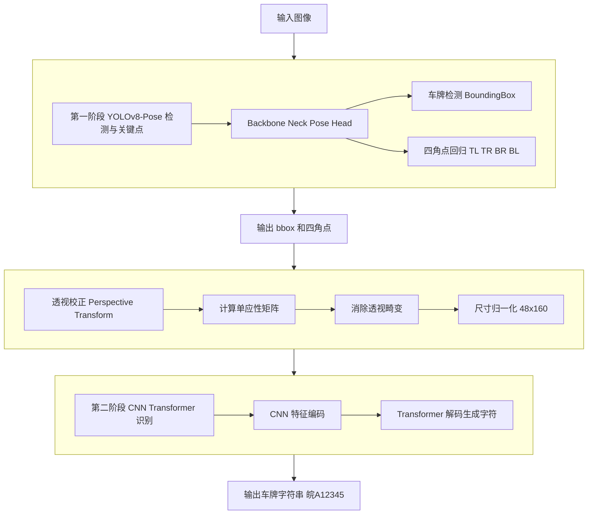

```mermaid
flowchart TB
    A[输入图像]

    subgraph S1[ ]
        T1[第一阶段 YOLOv8-Pose 检测与关键点]
        B1[Backbone Neck Pose Head]
        B2[车牌检测 BoundingBox]
        B3[四角点回归 TL TR BR BL]

        T1 --> B1
        B1 --> B2
        B1 --> B3
    end

    C[输出 bbox 和四角点]

    subgraph S2[ ]
        T2[透视校正 Perspective Transform]
        D1[计算单应性矩阵]
        D2[消除透视畸变]
        D3[尺寸归一化 48x160]

        T2 --> D1 --> D2 --> D3
    end

    subgraph S3[ ]
        T3[第二阶段 CNN Transformer 识别]
        E1[CNN 特征编码]
        E2[Transformer 解码生成字符]

        T3 --> E1 --> E2
    end

    F[输出车牌字符串 皖A12345]

    A --> S1 --> C --> S2 --> S3 --> F
```